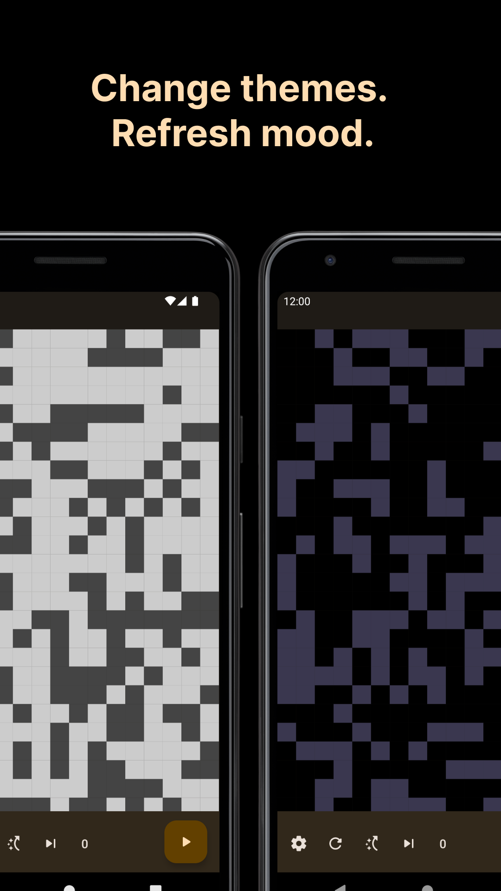

# Game of Life -Compose

Game of Life - Compose, is a zero player game that simulates the life of cell based on [John Conway’s cellular automaton game](https://en.wikipedia.org/wiki/Conway%27s_Game_of_Life).

## Download

<a href='https://play.google.com/store/apps/details?id=app.bruce.gameoflifecompose&pcampaignid=pcampaignidMKT-Other-global-all-co-prtnr-py-PartBadge-Mar2515-1'>
    
</a>

## App Features

- Various grid sizes
- Cool color options
- Different game speed
- Work on low-end mobile devices
- All free

## Technical Features

- User Interface | [Jetpack Compose](https://developer.android.com/jetpack/compose)
- Architecture | [MVVM](https://learn.microsoft.com/en-us/xamarin/xamarin-forms/enterprise-application-patterns/mvvm)
- Navigation | [Navigation Compose](https://developer.android.com/jetpack/compose/navigation)

## Screen Shots

|                    |                    |                    |                    | 
|--------------------|--------------------|--------------------|--------------------|
|  |  |  |  | 

## Show your support

Give a ⭐️ if this project helped you!

<a href="https://www.buymeacoffee.com/brucehsieh" target="_blank">
    
</a>

## License

```
MIT License

Copyright (c) 2022 Bruce Hsieh

Permission is hereby granted, free of charge, to any person obtaining a copy
of this software and associated documentation files (the "Software"), to deal
in the Software without restriction, including without limitation the rights
to use, copy, modify, merge, publish, distribute, sublicense, and/or sell
copies of the Software, and to permit persons to whom the Software is
furnished to do so, subject to the following conditions:

The above copyright notice and this permission notice shall be included in all
copies or substantial portions of the Software.

THE SOFTWARE IS PROVIDED "AS IS", WITHOUT WARRANTY OF ANY KIND, EXPRESS OR
IMPLIED, INCLUDING BUT NOT LIMITED TO THE WARRANTIES OF MERCHANTABILITY,
FITNESS FOR A PARTICULAR PURPOSE AND NONINFRINGEMENT. IN NO EVENT SHALL THE
AUTHORS OR COPYRIGHT HOLDERS BE LIABLE FOR ANY CLAIM, DAMAGES OR OTHER
LIABILITY, WHETHER IN AN ACTION OF CONTRACT, TORT OR OTHERWISE, ARISING FROM,
OUT OF OR IN CONNECTION WITH THE SOFTWARE OR THE USE OR OTHER DEALINGS IN THE
SOFTWARE.
```